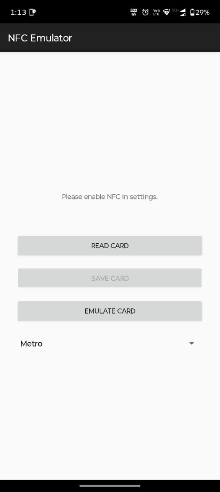

# NFC Emulator for Android

A simple Android application that allows you to read, store, and emulate NFC cards using Host Card Emulation (HCE).

## Important Notice

⚠️ **Current Repository Status**

This branch contains the project ZIP and reference files. The **latest and most up-to-date source code is available in the `master` branch**.

⚠️ **Limitations**

This application is intended for educational and research purposes only. It can read NFC card information and emulate basic card data through Android HCE, but it **cannot fully clone secure NFC cards**.

Currently, the application primarily works with card identifiers (UID) and limited publicly accessible data. Most modern NFC cards, payment cards, transport cards, and access-control cards use cryptographic authentication and secure challenge-response mechanisms that cannot be duplicated by simply copying the UID.

## Features

* **Read NFC Cards:** Supports various NFC technologies including IsoDep, Mifare Classic, Mifare Ultralight, and NDEF.
* **Store Cards:** Save scanned card data locally on your device with custom names.
* **Basic Emulation:** Emulate stored card information through Android Host Card Emulation (HCE).
* **Modern UI:** Simple interface built with Material Components.

## Project Status

🚧 **Under Development**

Work is currently in progress to improve emulation capabilities and APDU handling.

One of the major challenges is support for cards that require valid cryptographic authentication and dynamic challenge-response communication. These cards cannot be fully replicated using standard Android HCE alone.

Future development is focused on:

* Improved APDU command handling
* Better reader compatibility
* Enhanced emulation logic
* Research into secure card communication workflows

## Security Note

This app is for **educational purposes only**.

Many NFC systems rely on:

* Cryptographic keys
* Secure elements
* Dynamic challenge-response authentication
* Backend verification systems

Because of these security mechanisms, a successful read of a card does **not** mean the card can be fully cloned or emulated. In most cases, only publicly available information such as the UID can be reproduced.

## Disclaimer

This project does not bypass security mechanisms and is not intended to duplicate secure payment cards, transit cards, or access-control systems. Any emulation functionality provided is limited by Android HCE capabilities and the security features implemented by the original card issuer.

## Screenshot

## Screenshot

